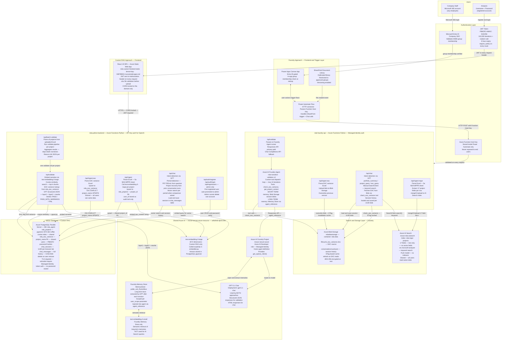

# Sentra — Full Architecture Diagram

> Paste the Mermaid block below into Lucidchart or https://mermaid.live to render it.

```mermaid
flowchart TB

    %% ══════════════════════════════════════════════════════
    %% USERS
    %% ══════════════════════════════════════════════════════
    subgraph USERS["Users"]
        Staff["Company Staff
        Microsoft 365 account
        (any employee)"]
        Analysts["Analysts
        Username + Password
        (registered account)"]
    end

    %% ══════════════════════════════════════════════════════
    %% AUTHENTICATION
    %% ══════════════════════════════════════════════════════
    subgraph AUTH["Authentication Layer"]
        direction LR
        EntraID["Microsoft Entra ID
        Company SSO
        Validates M365 group membership"]
        JWTAuth["JWT Token
        PBKDF2-HMAC-SHA256
        310,000 iterations + random salt
        8 hour expiry
        require_auth() on every route"]
        HostKey["Azure Function Host Key
        Stored inside Power Automate only
        Never exposed to end users"]
    end

    %% ══════════════════════════════════════════════════════
    %% FOUNDRY APPROACH — FRONTEND
    %% ══════════════════════════════════════════════════════
    subgraph FF["Foundry Approach — Frontend and Trigger Layer"]
        direction LR
        PA["Power Apps Canvas App
        Entra ID gated
        In-app group membership check at startup"]
        PAFlow["Power Automate Flow
        HTTP connector
        Passes Function Host Key
        Handles SharePoint trigger + Chat calls"]
        SP["SharePoint Document Library
        Dedicated library
        Restricted to approved groups
        Versioning enabled"]
    end

    %% ══════════════════════════════════════════════════════
    %% CUSTOM RAG APPROACH — FRONTEND
    %% ══════════════════════════════════════════════════════
    subgraph CF["Custom RAG Approach — Frontend"]
        React["React 19 SPA — Azure Static Web App
        nda-custom-frontend-static
        lemon-bay-04878fd03.4.azurestaticapps.net
        JWT sent in Authorization header on every request
        .xlsx file validation before upload
        CORS locked to this domain only"]
    end

    %% ══════════════════════════════════════════════════════
    %% FOUNDRY APPROACH — BACKEND
    %% ══════════════════════════════════════════════════════
    subgraph FB["nda-foundry-api — Azure Functions Python — Managed Identity auth"]
        direction TB

        FIngestMPPR["/api/ingest-mppr
        Parse Excel — 5a NDA MPPR sheet
        Extract 17 project fields per row
        mergeOrUpload to AI Search index"]

        FIngestEAC["/api/ingest-eac
        Parse EAC variance Excel
        Upload blob to Blob Storage
        Overwrites previous version"]

        FChat["/api/chat
        Intent detection via GPT
        portfolio_summary / project_query / eac_query
        Manual SearchClient — keyword search
        Fetches EAC from Blob via check_eac_variance tool
        Session history loaded and saved per UUID blob"]

        FValidate["/api/validate
        Passes to Foundry Agent runner
        Responses API primary path
        Chat Completions API fallback"]

        FAgent["Azure AI Foundry Agent
        nda-narrative-validator-v3
        Custom tool dispatch loop — max 10 iterations
        Tools: check_eac_variance, get_project_context
        SHORT-TERM memory: Blob Storage session blobs
        LONG-TERM memory: Memory Store via agent_reference"]
    end

    %% ══════════════════════════════════════════════════════
    %% CUSTOM RAG APPROACH — BACKEND
    %% ══════════════════════════════════════════════════════
    subgraph CB["nda-python-backend — Azure Functions Python — API Key auth for OpenAI"]
        direction TB

        CIngest["/api/ingest
        Parse Excel — 5a NDA MPPR sheet
        Call text-embedding-3-large per project
        Upsert to nda_projects — project_id PK
        user_id stored as audit trail only"]

        CIngestEAC["/api/ingest-eac
        Parse EAC variance Excel
        Upsert to nda_eac_variance
        ON CONFLICT project_name UPDATE
        Shared — all users see same data"]

        CValidate["/api/validate
        Embed narrative via text-embedding-3-large
        Cosine similarity search — top-k chunks
        EAC variance lookup from nda_eac_variance
        GPT structured JSON — layer1 + layer2 + rewrite
        Verdict: PASS / PASS_WITH_WARNINGS / FAIL"]

        CChat["/api/chat
        Intent detection via GPT
        Period detection — P07 P08 etc from question
        Project recovery from prior conversation turns
        Vector search per period when comparison asked
        Load and save session in chat_messages table"]

        CBatch["/api/batch-validate
        Parse all projects from uploaded Excel
        Run validate pipeline per project
        Aggregate results — skips blank narratives
        Returns full JSON per project"]

        CAuth["/api/auth/register  /api/auth/login
        /api/mgmt/users — admin only
        First registered user auto-promoted to admin
        Admin cannot delete own account"]
    end

    %% ══════════════════════════════════════════════════════
    %% FOUNDRY DATA LAYER
    %% ══════════════════════════════════════════════════════
    subgraph FD["Search and Storage Layer — Foundry"]
        direction LR
        AIS["Azure AI Search
        movar-nda-aisearch
        Index: nda-mppr-projects
        17 fields — text only — no vector fields
        en.microsoft analyser — keyword search
        Push model — no indexers
        Shared — all users read same index"]

        Blob["Azure Blob Storage
        ndadatastorage — container: nda-data
        lifecycle_eac_variance.xlsx — EAC source
        conversations/uuid.json — session history
        ETag-based cache refresh on EAC reads
        AES-256 encrypted at rest"]
    end

    %% ══════════════════════════════════════════════════════
    %% CUSTOM RAG DATA LAYER
    %% ══════════════════════════════════════════════════════
    subgraph CD["Vector Database — Custom RAG"]
        PG["Azure PostgreSQL Flexible Server — DB: nda_agent
        nda_projects — pgvector 3072-dim ivfflat cosine index — shared
        nda_eac_variance — project_name PK — shared
        users — PBKDF2 password hashes
        chat_sessions — UUID per browser tab
        chat_messages — full history — CASCADE delete on user remove
        TLS required — sslmode=require
        Managed Identity token auth — no password stored"]
    end

    %% ══════════════════════════════════════════════════════
    %% SHARED AI LAYER
    %% ══════════════════════════════════════════════════════
    subgraph AI["Shared Azure AI — movar-secure-azure-resource — sellafield-dpmo-dev"]
        direction TB

        GPT["GPT-5.1 Chat
        Deployment: gpt-5.1-chat
        Used by BOTH approaches
        Structured JSON responses for validation
        HTML responses for chat"]

        EmbedLarge["text-embedding-3-large
        3072 dimensions
        Custom RAG only
        Called explicitly in embedder.py
        Vectors stored in PostgreSQL pgvector"]

        EmbedSmall["text-embedding-3-small
        Foundry Memory Store only
        Semantic retrieval of long-term memories
        NOT used for AI Search queries"]

        FP["Azure AI Foundry Project
        movar-secure-azure
        Azure AI Developer role — Managed Identity
        Hosts agent definition
        Provides get_openai_client()"]

        MS["Foundry Memory Store
        MemoryStore-polite_cart_fhy4z4tbvx
        Long-term facts extracted by GPT after each session
        Scoped per user_scope parameter
        Injected into agent via agent_reference"]
    end

    %% ══════════════════════════════════════════════════════
    %% CONNECTIONS — USERS TO FRONTENDS
    %% ══════════════════════════════════════════════════════
    Staff -->|"Microsoft 365 login"| EntraID
    EntraID -->|"group membership verified"| PA
    Analysts -->|"register and login"| JWTAuth
    JWTAuth -->|"JWT in every request header"| React

    %% ══════════════════════════════════════════════════════
    %% CONNECTIONS — FOUNDRY FRONTEND TO BACKEND
    %% ══════════════════════════════════════════════════════
    SP -->|"file created event"| PAFlow
    PA <-->|"user actions trigger flows"| PAFlow
    PAFlow -->|"HTTP POST with Function Host Key"| HostKey
    HostKey -->|"validated on every request"| FB

    %% ══════════════════════════════════════════════════════
    %% CONNECTIONS — CUSTOM RAG FRONTEND TO BACKEND
    %% ══════════════════════════════════════════════════════
    React -->|"HTTPS — CORS locked — JWT required"| CB

    %% ══════════════════════════════════════════════════════
    %% CONNECTIONS — FOUNDRY BACKEND INTERNAL
    %% ══════════════════════════════════════════════════════
    FIngestMPPR -->|"mergeOrUpload 17-field docs"| AIS
    FIngestEAC -->|"overwrite blob — ETag invalidates cache"| Blob
    FChat -->|"SearchClient.search() keyword"| AIS
    FChat -->|"check_eac_variance — ETag cached"| Blob
    FChat -->|"load and save session UUID blob"| Blob
    FValidate --> FAgent
    FAgent -->|"Responses API — agent_reference"| FP
    FAgent -->|"tool calls — check_eac_variance"| Blob
    FP -->|"routes to model"| GPT
    FP <-->|"inject and extract memories"| MS
    MS <-->|"semantic retrieval"| EmbedSmall

    %% ══════════════════════════════════════════════════════
    %% CONNECTIONS — CUSTOM RAG BACKEND INTERNAL
    %% ══════════════════════════════════════════════════════
    CIngest -->|"embed raw_content string"| EmbedLarge
    CIngest -->|"upsert — shared project_id PK"| PG
    CIngestEAC -->|"ON CONFLICT project_name UPDATE"| PG
    CValidate -->|"embed narrative"| EmbedLarge
    CValidate -->|"cosine similarity — pgvector"| PG
    CValidate -->|"EAC flag and variance"| PG
    CValidate -->|"layer1 + layer2 + rewrite JSON"| GPT
    CChat -->|"embed query for vector search"| EmbedLarge
    CChat -->|"vector search and session history"| PG
    CBatch -->|"one validate call per project"| CValidate
    CAuth -->|"user CRUD and password verify"| PG
```