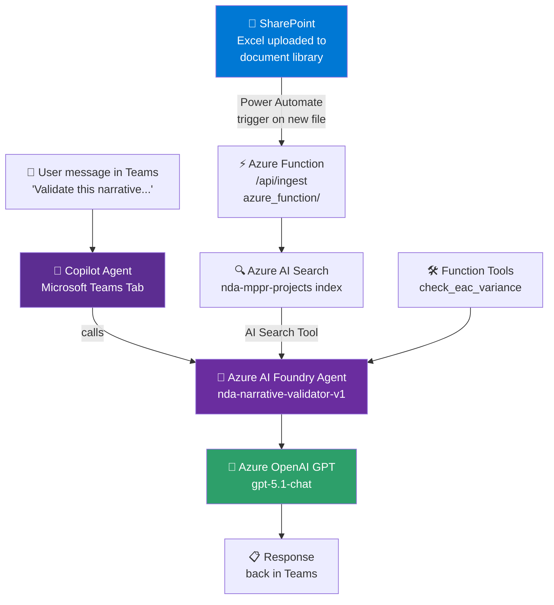
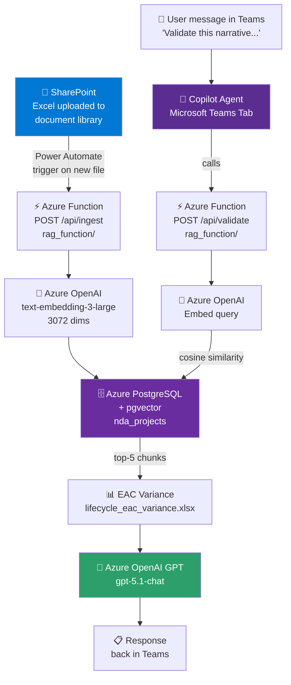
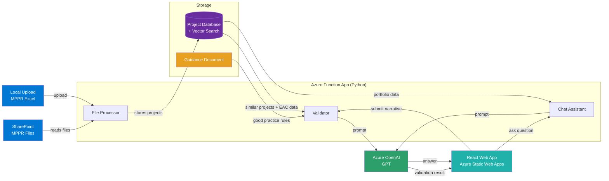

# NDA Narrative Validation — Architecture Flows

Two approaches to the same problem. Both share the same Azure OpenAI GPT and embedding deployments.

---

## Approach 1 — Azure AI Foundry Agent

**Selected path:**
`SharePoint` → `Power Automate` → `Azure Function` → `Azure AI Search` → `Foundry Agent` → `GPT` → `Copilot / Teams`

---

## Approach 2 — Open-Source RAG Pipeline

**Selected path:**
`SharePoint` → `Power Automate` → `Azure Function /ingest` → `PGVector` → `Azure Function /validate` → `GPT` → `Copilot / Teams`

---

## Approach 3 — Custom RAG + React Frontend (Current Production System)

**Selected path:**
`SharePoint List / Local Upload` → `React Frontend` → `Azure Function /api/*` → `PostgreSQL + pgvector` → `GPT` → `React Frontend`

---

## Side-by-Side Comparison

| | Approach 1 — Foundry Agent | Approach 2 — Open-Source RAG |
|---|---|---|
| **Document source** | SharePoint → Power Automate → Azure Function | SharePoint → Power Automate → Azure Function |
| **Vector store** | Azure AI Search (managed) | Azure PostgreSQL + pgvector |
| **Embedding** | Azure AI Search built-in | text-embedding-3-large (3072d) |
| **Orchestration** | Azure AI Foundry Agent | Direct Python RAG pipeline |
| **User interface** | Copilot Agent / Teams Tab | Copilot Agent / Teams Tab |
| **EAC Tools** | Foundry Function Tools | Python functions in validate.py |
| **Auth** | Service principal + AI Search role | Entra ID token for PostgreSQL |
| **Status** | ⏳ Awaiting Search Index Data Reader | ✅ Pipeline built, DB live |
