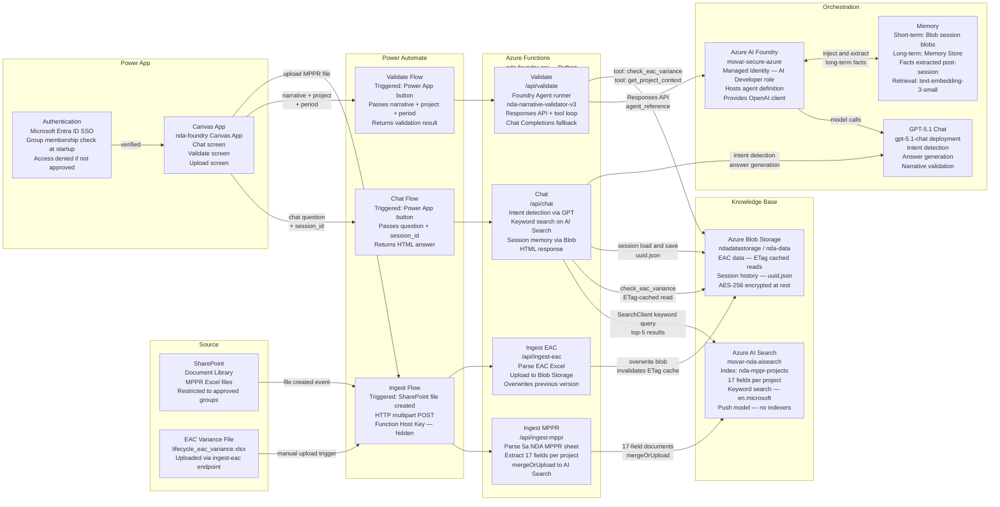

# Foundry Agent Approach — Architecture Diagram

```mermaid
flowchart LR

    subgraph SRC["Source"]
        direction TB
        SP["SharePoint\nDocument Library\nMPPR Excel files\nRestricted to approved groups"]
        BLOB_EAC["EAC Variance File\nlifecycle_eac_variance.xlsx\nUploaded via ingest-eac endpoint"]
    end

    subgraph KB["Knowledge Base"]
        direction TB
        AIS["Azure AI Search\nmovar-nda-aisearch\nIndex: nda-mppr-projects\n17 fields per project\nKeyword search — en.microsoft\nPush model — no indexers"]
        BLOB["Azure Blob Storage\nndadatastorage / nda-data\nEAC data — ETag cached reads\nSession history — uuid.json\nAES-256 encrypted at rest"]
    end

    subgraph ORCH["Orchestration"]
        direction TB
        FP["Azure AI Foundry\nmovar-secure-azure\nManaged Identity — AI Developer role\nHosts agent definition\nProvides OpenAI client"]
        GPT["GPT-5.1 Chat\ngpt-5.1-chat deployment\nIntent detection\nAnswer generation\nNarrative validation"]
        MEM["Memory\nShort-term: Blob session blobs\nLong-term: Memory Store\nFacts extracted post-session\nRetrieval: text-embedding-3-small"]
    end

    subgraph AZF["Azure Functions\nnda-foundry-api — Python\nManaged Identity auth"]
        direction TB
        FN_INGEST["Ingest MPPR\n/api/ingest-mppr\nParse 5a NDA MPPR sheet\nExtract 17 fields per project\nmergeOrUpload to AI Search"]
        FN_EAC["Ingest EAC\n/api/ingest-eac\nParse EAC Excel\nUpload to Blob Storage\nOverwrites previous version"]
        FN_CHAT["Chat\n/api/chat\nIntent detection via GPT\nKeyword search on AI Search\nSession memory via Blob\nHTML response"]
        FN_VAL["Validate\n/api/validate\nFoundry Agent runner\nnda-narrative-validator-v3\nResponses API + tool loop\nChat Completions fallback"]
    end

    subgraph PAF["Power Automate"]
        direction TB
        FLOW_IN["Ingest Flow\nTriggered: SharePoint file created\nHTTP multipart POST\nFunction Host Key — hidden"]
        FLOW_CHAT["Chat Flow\nTriggered: Power App button\nPasses question + session_id\nReturns HTML answer"]
        FLOW_VAL["Validate Flow\nTriggered: Power App button\nPasses narrative + project + period\nReturns validation result"]
    end

    subgraph APP["Power App"]
        direction TB
        ENTRA["Authentication\nMicrosoft Entra ID SSO\nGroup membership check at startup\nAccess denied if not approved"]
        PA["Canvas App\nnda-foundry Canvas App\nChat screen\nValidate screen\nUpload screen"]
    end

    %% ── Ingestion path ──────────────────────────────
    SP -->|"file created event"| FLOW_IN
    BLOB_EAC -->|"manual upload trigger"| FLOW_IN
    FLOW_IN --> FN_INGEST
    FLOW_IN --> FN_EAC
    FN_INGEST -->|"17-field documents\nmergeOrUpload"| AIS
    FN_EAC -->|"overwrite blob\ninvalidates ETag cache"| BLOB

    %% ── Chat path ───────────────────────────────────
    FN_CHAT -->|"SearchClient keyword query\ntop-5 results"| AIS
    FN_CHAT -->|"check_eac_variance\nETag-cached read"| BLOB
    FN_CHAT -->|"session load and save\nuuid.json"| BLOB
    FN_CHAT -->|"intent detection\nanswer generation"| GPT
    FLOW_CHAT --> FN_CHAT

    %% ── Validate path ───────────────────────────────
    FN_VAL -->|"Responses API\nagent_reference"| FP
    FN_VAL -->|"tool: check_eac_variance\ntool: get_project_context"| BLOB
    FP -->|"model calls"| GPT
    FP <-->|"inject and extract\nlong-term facts"| MEM
    FLOW_VAL --> FN_VAL

    %% ── Power App flows ─────────────────────────────
    ENTRA -->|"verified"| PA
    PA -->|"chat question\n+ session_id"| FLOW_CHAT
    PA -->|"narrative + project\n+ period"| FLOW_VAL
    PA -->|"upload MPPR file"| FLOW_IN
```