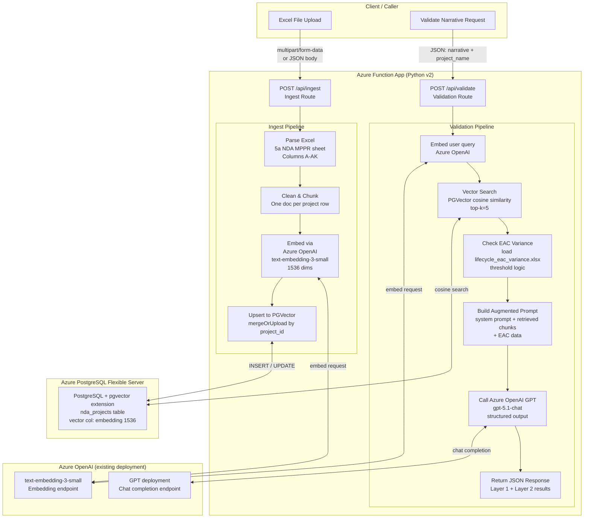
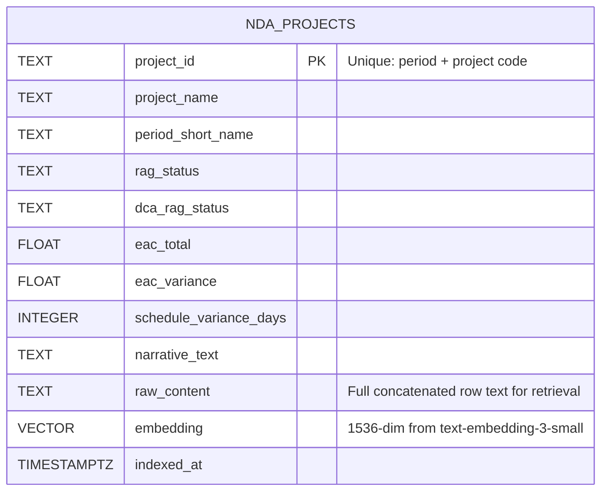
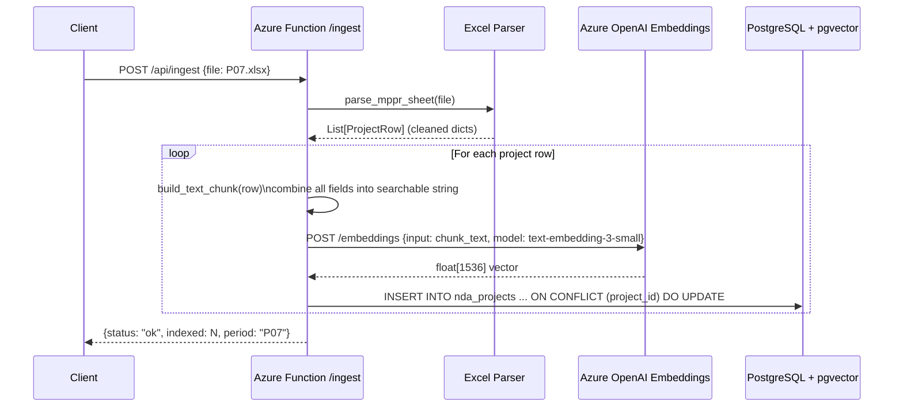
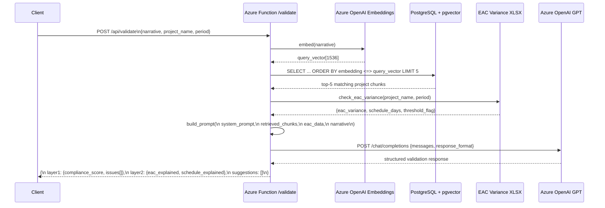

# NDA Narrative Validation — Open-Source RAG Architecture Plan

## Overview

Replace Azure AI Search + Azure AI Foundry Agent with a self-contained
RAG pipeline using Azure OpenAI embeddings, Azure PostgreSQL + pgvector,
and a two-route Azure Function API. The existing Excel extraction logic
and EAC variance tools are reused unchanged.

---

## System Architecture



---

## Database Schema



---

## Process Flows

### Ingest Flow — POST /api/ingest



### Validation Flow — POST /api/validate



---

## Folder Structure (proposed changes)

```
Custom Solution/
├── azure_function/
│   ├── function_app.py          ← ADD /ingest + /validate routes
│   ├── ingest.py                ← NEW: Excel parse → embed → PGVector upsert
│   ├── validate.py              ← NEW: query embed → vector search → GPT call
│   ├── db.py                    ← NEW: PostgreSQL connection pool + pgvector helpers
│   ├── embedder.py              ← NEW: Azure OpenAI embedding wrapper
│   ├── requirements.txt         ← ADD: psycopg2-binary, pgvector, openai
│   └── local.settings.json      ← ADD: POSTGRES_*, AZURE_OPENAI_* vars
│
├── agent/                       ← KEEP as-is (Foundry agent, used when perms fixed)
├── NDA Data/                    ← KEEP (EAC xlsx file read by validate.py)
└── README.md                    ← UPDATE with new architecture
```

---

## New Environment Variables

| Variable | Used in | Description |
|---|---|---|
| `POSTGRES_HOST` | db.py | Azure PostgreSQL server hostname |
| `POSTGRES_DB` | db.py | Database name |
| `POSTGRES_USER` | db.py | DB username |
| `POSTGRES_PASSWORD` | db.py | DB password |
| `POSTGRES_PORT` | db.py | Default: 5432 |
| `AZURE_OPENAI_ENDPOINT` | embedder.py | Your Azure OpenAI resource endpoint |
| `AZURE_OPENAI_API_KEY` | embedder.py | Azure OpenAI API key |
| `AZURE_OPENAI_EMBEDDING_DEPLOYMENT` | embedder.py | e.g. `text-embedding-3-small` |
| `AZURE_OPENAI_CHAT_DEPLOYMENT` | validate.py | e.g. `gpt-5.1-chat` |

---

## Implementation Phases

### Phase 1 — Database + Embedding Setup
- Provision Azure PostgreSQL Flexible Server
- Enable `pgvector` extension: `CREATE EXTENSION vector;`
- Create `nda_projects` table with `embedding vector(1536)` column
- Create `ivfflat` index on embedding column for fast cosine search
- Write `db.py` (connection pool) and `embedder.py` (OpenAI wrapper)

### Phase 2 — Ingest Route
- Write `ingest.py`: reuse existing Excel parser → build text chunks → embed → upsert
- Add `POST /api/ingest` route to [function_app.py](file:///C:/Users/rahul/Repos/Sentra%20Project%20BSBI/Custom%20Solution/azure_function/function_app.py)
- Test: upload P07 → verify rows in pg with `SELECT count(*) FROM nda_projects`

### Phase 3 — Validate Route
- Write `validate.py`: embed query → pgvector cosine search → EAC check → GPT call
- Structured output format matches current agent response (Layer 1 + Layer 2)
- Add `POST /api/validate` route to [function_app.py](file:///C:/Users/rahul/Repos/Sentra%20Project%20BSBI/Custom%20Solution/azure_function/function_app.py)
- Test: send a known narrative → verify correct project retrieved + EAC flag applies

### Phase 4 — Deploy & Wire Up
- Deploy updated Azure Function
- Update [local.settings.json](file:///C:/Users/rahul/Repos/Sentra%20Project%20BSBI/Custom%20Solution/agent/local.settings.json) / App Settings with Postgres + OpenAI vars
- Optionally retire the Azure AI Foundry Agent route once this is stable

---

## Key Technical Decisions

| Decision | Choice | Rationale |
|---|---|---|
| Embedding model | `text-embedding-3-small` (Azure OpenAI) | Already deployed, 1536 dims, fast, no cold start |
| Vector DB | Azure PostgreSQL + pgvector | Managed, no file persistence issues, SQL metadata filtering |
| Distance metric | Cosine similarity (`<=>` operator) | Best for text embeddings |
| Index type | `ivfflat` (lists=100) | Good balance of speed vs recall for ~1000 rows |
| Chunk strategy | One row = one document | Each project row is self-contained |
| GPT call | Direct `openai` SDK (Azure endpoint) | No LangChain overhead, simpler prompt control |
| EAC check | Same [tools.py](file:///C:/Users/rahul/Repos/Sentra%20Project%20BSBI/Custom%20Solution/agent/tools.py) functions | Zero code change, already tested |
