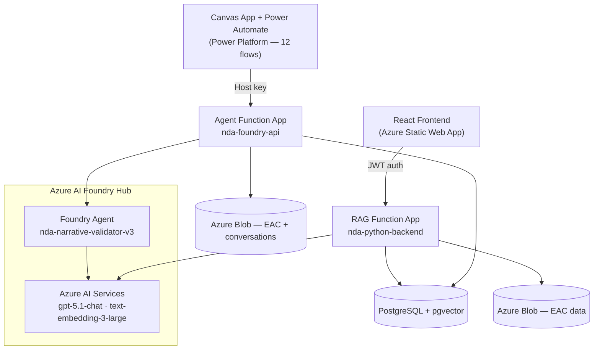

# NDA Narrative Validation System

AI-powered tool for validating NDA project narrative reports against formatting guidelines, EAC (Estimate at Completion) variance data, and schedule movements.

---

## Architecture Overview

The system provides **two independent validation approaches** that can be used side-by-side:

| | Custom Approach (`rag_function/`) | Foundry Approach (`agent/`) |
|---|---|---|
| **Folder** | `rag_function/` | `agent/` |
| **Function App** | `nda-python-backend` | `nda-foundry-api` |
| **AI Backend** | Azure OpenAI (GPT) + PGVector | Azure AI Foundry Agent |
| **Auth** | JWT login/register, per-user data isolation | Azure Function host key only |
| **Validation Output** | Structured JSON (scores, issues, rewrite) | Free-form agent analysis |
| **Memory** | PostgreSQL session history (per user) | Azure Blob Storage conversation blobs |
| **Search** | PGVector cosine similarity | PGVector cosine similarity |



---

## Project Structure

```
├── rag_function/                   # Custom RAG approach (Python)
│   ├── function_app.py             # All HTTP routes (auth/admin/data)
│   ├── auth.py                     # JWT authentication + user management
│   ├── db.py                       # PostgreSQL + pgvector pool + schema bootstrap
│   ├── embedder.py                 # Azure OpenAI embedding wrapper
│   ├── ingest.py                   # MPPR Excel parser + PGVector upsert (per-user)
│   ├── ingest_eac.py               # EAC variance Excel parser + upsert (per-user)
│   ├── validate.py                 # Single narrative validation pipeline
│   ├── batch_validate.py           # Batch validation pipeline
│   ├── chat.py                     # Conversational RAG pipeline (per-user)
│   ├── conversation.py             # PostgreSQL chat session + history management
│   ├── requirements.txt            # Python dependencies (includes PyJWT)
│   └── local.settings.json         # Dev credentials (gitignored)
│
├── agent/                          # Foundry approach (Python)
│   ├── function_app.py             # Azure Functions entry point
│   ├── agent_runner.py             # Foundry agent execution + blob memory
│   ├── batch_validate.py           # Batch validation for Foundry agent
│   ├── chat.py                     # Conversational chat via Foundry agent
│   ├── tools.py                    # EAC/schedule tool functions
│   ├── system_prompt.py            # Agent system prompt
│   ├── ingest_helper.py            # AI Search indexing + project search
│   ├── guidance_loader.py          # Loads Good Practice Guidelines from Blob
│   ├── config.py                   # Centralised configuration
│   ├── setup_memory.py             # Foundry Memory Store setup CLI
│   └── local.settings.json         # Dev credentials (gitignored)
│
├── frontend/                       # React + TypeScript UI (Custom approach)
│   ├── public/
│   │   └── staticwebapp.config.json  # SPA routing fallback for Azure Static Web Apps
│   └── src/
│       ├── context/
│       │   ├── AuthContext.tsx     # JWT state (token/username/is_admin) in localStorage
│       │   └── ValidationContext.tsx # Persisted batch/validate state + history log (localStorage)
│       ├── components/
│       │   ├── Sidebar.tsx         # Nav + logged-in user + logout + admin link
│       │   └── ProtectedRoute.tsx  # Redirects to /login if unauthenticated
│       ├── views/
│       │   ├── LoginView.tsx       # Sign in / Register (tab switcher)
│       │   ├── AdminView.tsx       # User management table (admin only)
│       │   ├── ChatView.tsx        # Conversational RAG assistant
│       │   ├── ValidateView.tsx    # Single narrative validation + project search
│       │   ├── BatchValidateView.tsx # Batch validation with persistent progress state
│       │   ├── IngestView.tsx      # Data upload (MPPR + EAC)
│       │   └── AnalyticsView.tsx   # Validation history log (per-user, stored in localStorage)
│       └── services/
│           └── api.ts              # All API calls with JWT auth header
│
├── test_remote.py               # Remote smoke test for custom validate endpoint
├── test_deployment.py           # Remote smoke test for Foundry validate endpoint
├── test_local.py                # Local unit tests
├── test_rag.py                  # End-to-end RAG pipeline test
├── test_e2e.py                  # End-to-end test suite
├── test_agent.py                # Agent integration tests
├── debug_agent_run.py           # Debug script for Foundry agent execution
├── debug_agent_permissions.py   # RBAC/permissions check for Foundry agent
├── setup_db.py                  # One-time PostgreSQL schema setup script
├── ingest_files.py              # Bulk local ingest utility
├── clean_mppr_data.py           # MPPR data cleaning utility
└── README.md
```

---

## API Endpoints

### RAG Function App (`nda-python-backend`)

All data routes require `Authorization: Bearer <token>`. Admin routes additionally require an admin account.

**Auth (public)**

| Method | Route | Description |
|--------|-------|-------------|
| POST | `/api/auth/register` | Create account — first user is auto-admin |
| POST | `/api/auth/login` | Returns JWT token (8-hour expiry) |

**Admin (admin JWT required)**

| Method | Route | Description |
|--------|-------|-------------|
| GET  | `/api/mgmt/users` | List all users with stats |
| POST | `/api/mgmt/users/update` | Toggle `is_active` or `is_admin` flag |
| POST | `/api/mgmt/users/delete` | Delete user and all their data |

**Data (auth JWT required)**

| Method | Route | Description |
|--------|-------|-------------|
| POST | `/api/ingest` | Upload MPPR Excel → embed → store in PGVector (per-user) |
| POST | `/api/ingest-eac` | Upload EAC variance Excel → store in PostgreSQL (per-user) |
| POST | `/api/validate` | Validate single narrative (structured JSON result) |
| POST | `/api/chat` | Conversational RAG with PostgreSQL session memory (per-user) |
| POST | `/api/list-projects` | Extract project list from Excel (no DB write) |
| POST | `/api/batch-validate` | Validate all narratives in an Excel file |
| GET  | `/api/search-projects?q=<term>` | Search user's indexed projects by name |

### Agent Function App (`nda-foundry-api`)

These are the **active pgvector-backed routes** — what Power Automate flows and the React engine toggle call:

| Method | Route | Description |
|--------|-------|-------------|
| POST | `/api/pgvector/ingest-mppr` | Upload MPPR Excel → embed → store in PGVector |
| POST | `/api/pgvector/ingest-eac` | Upload EAC variance Excel → Azure Blob Storage |
| POST | `/api/pgvector/validate` | Validate narrative using Foundry agent + PGVector context |
| POST | `/api/pgvector/batch-validate` | Batch validate all narratives in an Excel file |
| POST | `/api/pgvector/chat` | Conversational QA via Foundry agent + PGVector |
| POST | `/api/pgvector/list-projects` | Extract project list from Excel (no DB write) |
| GET  | `/api/pgvector/search-projects?q=<term>` | Search indexed projects by name |
| GET  | `/api/pgvector/history` | Retrieve conversation history |
| POST | `/api/pa-batch-validate` | Power Automate batch validate (internally calls pgvector backend) |

Legacy routes (`/api/validate`, `/api/chat`, etc.) still exist in the code but are backed by Azure AI Search and are not used by current flows.

---

## Conversation Memory

### RAG Function

**Short-term (PostgreSQL session memory)**
- First `/api/chat` call creates a session UUID scoped to the logged-in user
- Client stores UUID in `localStorage` and sends it on subsequent calls
- PostgreSQL `chat_sessions` + `chat_messages` tables store full history
- Last 20 messages are injected per LLM call; full history retained for audit

### Agent Function

**Short-term (Azure Blob Storage)**
- First `/api/pgvector/validate` or `/api/pgvector/chat` call generates a UUID conversation ID
- Conversation history stored as a JSON blob: `nda-data/conversations/<uuid>.json`
- Client passes `conversation_id` on follow-up calls to resume context within the same session
- Non-fatal: if the blob write fails, validation still completes

---

## Frontend Features

### Login / Register (`/login`)
- Public page — only entry point without a token
- Tab switcher between Sign In and Register
- First registered account is automatically admin
- Token stored in `localStorage`, survives page refresh

### Chat (`/chat`)
- Conversational interface backed by the RAG function
- Session history persisted in PostgreSQL (scoped to logged-in user)
- "New Conversation" button to clear history

### Individual Narrative Validation (`/validate`)
- Upload MPPR Excel to auto-populate project list
- **Wild search**: type in the project name field to search projects already indexed in PGVector — no Excel upload needed
- Structured validation result: compliance score, Layer 1 (format) + Layer 2 (data) issues
- AI rewritten narrative

### Batch Validation (`/batch-validate`)
- Upload MPPR Excel to validate all projects at once
- **Engine toggle**: switch between RAG (structured output) and AI Foundry Agent (deep narrative analysis)
- Live progress bar showing current project
- Export results to Excel

### Data Ingest (`/ingest`)
- Upload MPPR Excel to index into PGVector (data scoped to your account)
- Upload EAC variance Excel to update your financial reference data

### Analytics (`/analytics`)
- Persistent history log of every validation run (individual and batch), stored in browser localStorage
- Summary cards: Total Scored, Pass, Warnings, Fail, Individual count, Batch count
- Pass rate bar showing Pass / Warn / Fail proportions
- Filterable and sortable scores table with verdict badges, scores, and timestamps
- History survives page navigation and browser refresh; scoped per analyst per browser

### Admin Panel (`/admin` — admin only)
- User management table: all registered users with project and session counts
- Toggle active/inactive status per user
- Toggle admin rights per user
- Delete user and all associated data

---

## Setup

### Prerequisites
- Azure subscription with:
  - Azure Database for PostgreSQL Flexible Server (with pgvector extension enabled via `setup_db.py`)
  - Azure AI Services (S0) — provides GPT chat (`gpt-5.1-chat`) and embedding (`text-embedding-3-large`) deployments
  - Azure AI Foundry Hub — separate resource from AI Services; the Foundry project and agent (`nda-narrative-validator-v3`) live inside it
  - Azure Blob Storage account (`nda-data` container for EAC + conversation blobs; `guidance` container for Good Practice DOCX)
  - Azure Static Web App (`nda-custom-frontend-static`) for the React frontend

### Local Development

**RAG function:**
```bash
cd rag_function
# Fill in local.settings.json with real values including JWT_SECRET
pip install -r requirements.txt
func start
```

**Agent function:**
```bash
cd agent
# Fill in local.settings.json with real values
func start
```

**Frontend:**
```bash
cd frontend
npm install
# Create frontend/src/local.settings.json with AZURE_FUNCTION_KEY
npm run dev
# Opens at http://localhost:5173 → redirects to /login
# Register the first account → it becomes admin automatically
```

### Deployment

**One-time: PostgreSQL setup**

Before deploying either function app to a new environment, enable the pgvector extension and create all required tables:
```bash
# Run from repo root — requires POSTGRES_* env vars to be set
python setup_db.py
```

**RAG function:**
```bash
cd rag_function
func azure functionapp publish nda-python-backend --python
```

**Agent function:**
```bash
cd agent
func azure functionapp publish nda-foundry-api --python
```

**Frontend — Azure Static Web Apps**

Hosted at: `https://lemon-bay-04878fd03.4.azurestaticapps.net`
Resource: `nda-custom-frontend-static` (Resource Group: `sellafield-dpmo-dev`, Region: West Europe)

Prerequisites (one-time):
```bash
npm install -g @azure/static-web-apps-cli
```

Step 1 — Confirm `frontend/.env.production` contains real values (Vite bakes these into the bundle at build time):
```
VITE_AZURE_FUNCTION_KEY=<rag-function-host-key>
VITE_API_BASE_URL=https://nda-python-backend.azurewebsites.net/api
```

Step 2 — Build:
```bash
cd frontend
npm run build
# Output: frontend/dist/
```

Step 3 — Get the deployment token (only needed once; token does not expire):
```bash
az staticwebapp secrets list \
  --name nda-custom-frontend-static \
  --resource-group sellafield-dpmo-dev \
  --query "properties.apiKey" -o tsv
```

Step 4 — Deploy (run from inside `frontend/`):
```bash
swa deploy dist --deployment-token <TOKEN> --env production
```

For any future frontend change, only Steps 2 and 4 are needed. The Python function apps do not need redeploying for frontend-only changes.

> **Note:** `frontend/public/staticwebapp.config.json` handles SPA client-side routing so all routes (`/validate`, `/analytics`, etc.) work when navigated to directly. This file is automatically copied into `dist/` by Vite at build time.

---

## Configuration

Both function apps read all settings from environment variables. In local dev these come from `local.settings.json` (gitignored). In Azure they come from Function App Settings.

### Key settings — RAG function

| Variable | Description |
|----------|-------------|
| `POSTGRES_HOST` | PostgreSQL server hostname |
| `POSTGRES_DB` | Database name |
| `POSTGRES_USER` | DB user (Entra ID email or username) |
| `POSTGRES_PASSWORD` | DB password (leave empty for Managed Identity) |
| `AZURE_OPENAI_ENDPOINT` | Azure OpenAI resource URL |
| `AZURE_OPENAI_API_KEY` | Azure OpenAI API key |
| `AZURE_OPENAI_EMBEDDING_DEPLOYMENT` | Embedding model deployment name |
| `AZURE_OPENAI_EMBEDDING_DIMS` | Embedding dimensions (e.g. `3072` for text-embedding-3-large) |
| `AZURE_OPENAI_CHAT_DEPLOYMENT` | Chat model deployment name |
| `JWT_SECRET` | Random secret for signing JWT tokens — **required for auth to work** |

### Key settings — Agent function

| Variable | Description |
|----------|-------------|
| `AZURE_FOUNDRY_PROJECT_ENDPOINT` | AI Foundry project endpoint URL |
| `AZURE_FOUNDRY_MODEL_DEPLOYMENT` | Chat model deployment name |
| `AZURE_STORAGE_ACCOUNT_URL` | Blob storage URL (EAC + conversation blobs) |
| `POSTGRES_HOST` | PostgreSQL server hostname (shared with RAG function) |
| `POSTGRES_DB` | Database name |
| `POSTGRES_USER` | DB user |
| `POSTGRES_PASSWORD` | DB password (leave empty for Managed Identity) |
| `AZURE_OPENAI_ENDPOINT` | Azure AI Services endpoint (for embeddings) |
| `AZURE_OPENAI_API_KEY` | Azure AI Services API key |
| `AZURE_OPENAI_EMBEDDING_DEPLOYMENT` | Embedding model deployment name |
| `AZURE_OPENAI_EMBEDDING_DIMS` | Embedding dimensions (e.g. `3072` for text-embedding-3-large) |

---

## Testing

```bash
# RAG memory tests (unit + remote)
python test_conversation_memory.py --unit
python test_conversation_memory.py --remote

# Agent memory tests (unit + remote)
python test_agent_memory.py --unit
python test_agent_memory.py --remote
```

Settings are automatically loaded from `agent/local.settings.json` and `rag_function/local.settings.json`.

---

## Data Format

The system expects the NDA Executive Project Summary Excel file with a sheet named `5a)NDA MPPR`. Each project spans 2–3 rows:
- **Data row**: project name (col 1), DCA RAG status (col 3), numeric EAC/schedule data
- **Narrative row**: project name (col 0), narrative text (col 1)
- **Blank separator row**

EAC variance thresholds (agreed with stakeholders):
- `< £50k` — no comment needed
- `£50k–£100k` — monitoring flag
- `≥ £100k` — must appear in narrative
- `≥ £500k` — requires explicit explanation