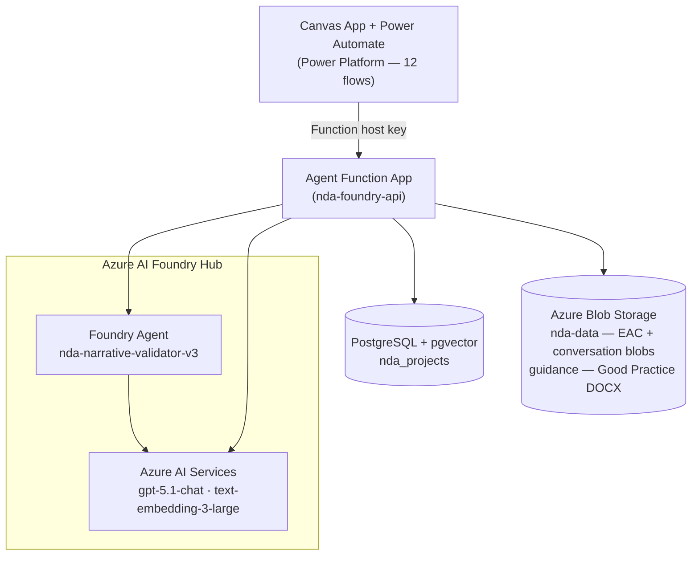

# NDA Narrative Validator — Foundry Approach

Azure Functions Python backend for validating NDA project narrative reports, backed by Azure AI Foundry and pgvector. Called by Power Automate flows from a Power Apps Canvas App.

Validation is free-form — the Foundry agent analyses narratives against Good Practice Guidelines and EAC data and returns a detailed narrative response. No per-user auth — all calls use the Azure Function host key embedded in Power Automate flows.

---

## What this repo contains

| Folder / File | Purpose |
|---|---|
| `agent/` | Python Azure Function App — all API routes |
| `setup_db.py` | One-time script to enable pgvector on a new PostgreSQL server |

Power Apps Canvas App and Power Automate flows live in Power Platform — not in this repo.

---

## Folder Structure

```
agent/
├── function_app.py         Azure Functions v2 entry point — all HTTP route definitions
├── pgvector_backend.py     Active backend for all 12 Power Automate flows (pgvector routes)
├── agent_runner.py         Foundry agent execution + conversation blob management
├── batch_validate.py       Loops validate per project row for batch calls
├── chat.py                 Chat wrapper — loads/saves conversation blob, calls agent
├── tools.py                Tool functions the Foundry agent calls (EAC lookup, schedule check)
├── system_prompt.py        Agent system prompt text — validation rules and output format
├── guidance_loader.py      Fetches Good Practice Guidelines DOCX from Blob (cached)
├── ingest_helper.py        AI Search indexing and search — legacy, not used by current flows
├── config.py               Centralised env var reading — all modules import from here
├── create_agent.py         One-time script to create the Foundry agent (not part of runtime)
├── setup_memory.py         CLI for Foundry Memory Store setup (not used in production)
├── requirements.txt        Python dependencies
└── host.json               Azure Functions host configuration
```

---

## How it works



1. A Power Automate flow calls the Function App with a host key.
2. The Function App retrieves relevant project context from pgvector.
3. The Foundry agent receives the narrative + context + EAC data and generates a detailed validation response.
4. Conversation history is stored as a JSON blob in Azure Blob Storage for within-session continuity.

---

## Deployment

```bash
cd agent
func azure functionapp publish nda-foundry-api --python
```

Run `python setup_db.py` once on any new PostgreSQL server before deploying.

---

## Documentation

| Doc | Contents |
|---|---|
| [Architecture](docs/architecture.md) | System components, data flow diagrams |
| [API Endpoints](docs/api-endpoints.md) | All routes and what they do |
| [Code Structure](docs/code-structure.md) | What each file does and why |
| [Design Flows](docs/design-flows.md) | Step-by-step request flows from Power Automate to response |
| [Power Platform](docs/power-platform.md) | Canvas App, all 12 flows, which endpoint each calls |

---

## Key environment variables

| Variable | Purpose |
|---|---|
| `AZURE_FOUNDRY_PROJECT_ENDPOINT` | AI Foundry project endpoint URL |
| `AZURE_FOUNDRY_MODEL_DEPLOYMENT` | Chat model deployment name (gpt-5.1-chat) |
| `AZURE_STORAGE_ACCOUNT_URL` | Blob Storage URL for EAC + conversation blobs |
| `POSTGRES_HOST` | PostgreSQL server hostname |
| `POSTGRES_DB` | Database name |
| `POSTGRES_USER` | DB user |
| `POSTGRES_PASSWORD` | DB password (leave empty for Managed Identity) |
| `AZURE_OPENAI_ENDPOINT` | Azure AI Services endpoint (for embeddings) |
| `AZURE_OPENAI_API_KEY` | Azure AI Services API key |
| `AZURE_OPENAI_EMBEDDING_DEPLOYMENT` | Embedding model (text-embedding-3-large) |
| `AZURE_OPENAI_EMBEDDING_DIMS` | Embedding dimensions (3072) |