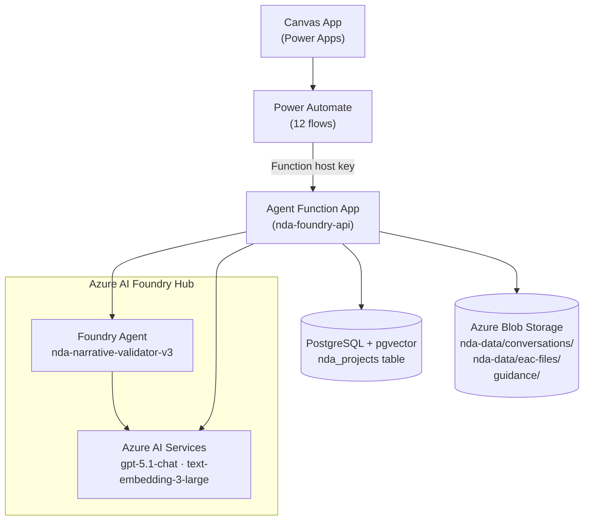
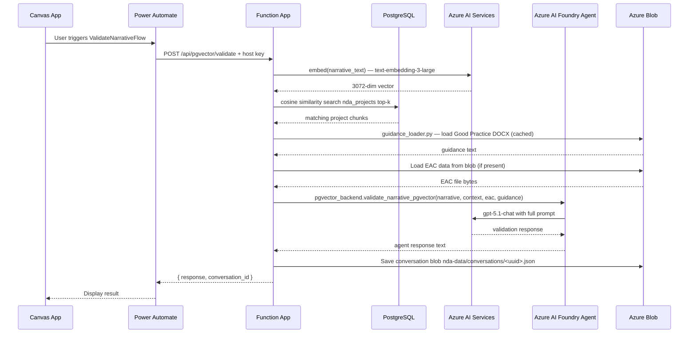
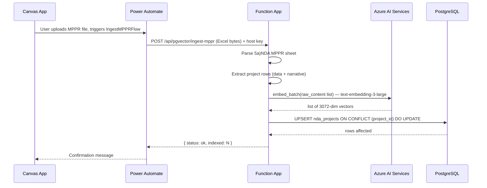
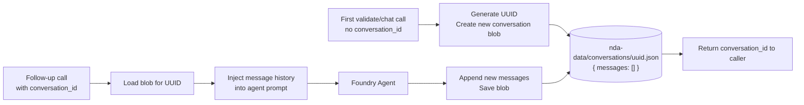
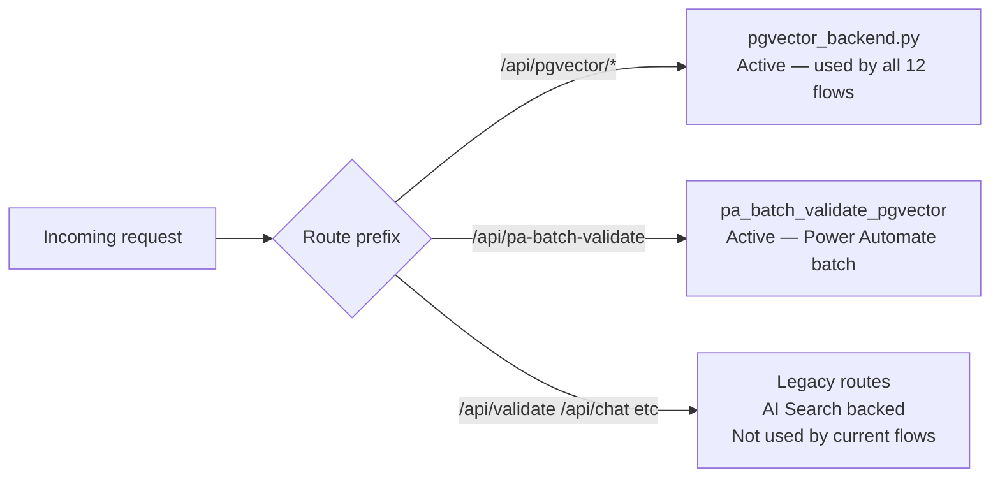

# Architecture — Foundry Approach

---

## System Overview

---

## Request Flow — Narrative Validation

---

## Request Flow — MPPR Ingest

---

## Conversation Memory

Short-term memory is stored as JSON blobs in Azure Blob Storage.

Non-fatal: if the blob write fails, validation still completes. History is lost for that session but no error is returned to the caller.

---

## pgvector vs Legacy Routes

The function app contains two sets of routes:

All 12 Power Automate flows call either `/api/pgvector/*` routes or `/api/pa-batch-validate`. Legacy routes remain in the code for reference but are not called.

---

## Component Responsibilities

| Component | Responsibility |
|---|---|
| `function_app.py` | Route definitions, request parsing, error handling |
| `pgvector_backend.py` | pgvector-backed validation, chat, ingest — what flows actually call |
| `agent_runner.py` | Foundry agent execution, blob conversation memory management |
| `batch_validate.py` | Loops validation per project for batch calls |
| `chat.py` | Chat wrapper — manages conversation blob and calls the agent |
| `tools.py` | Tool functions the Foundry agent calls (EAC lookup, schedule check) |
| `system_prompt.py` | Agent system prompt text |
| `ingest_helper.py` | AI Search indexing and search (legacy, not used by current flows) |
| `guidance_loader.py` | Fetches Good Practice DOCX from Blob (cached per cold start) |
| `config.py` | Centralised env var reading — all other modules import from here |
| `create_agent.py` | One-time script to create the Foundry agent (not part of runtime) |
| `setup_memory.py` | CLI for Foundry Memory Store setup (not used in production) |