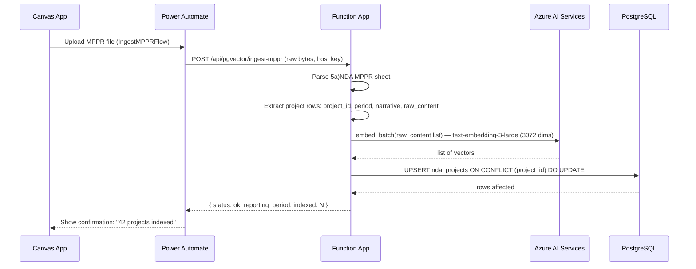
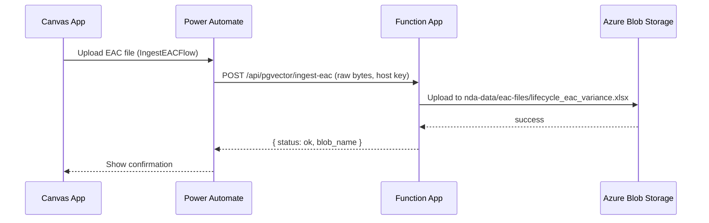
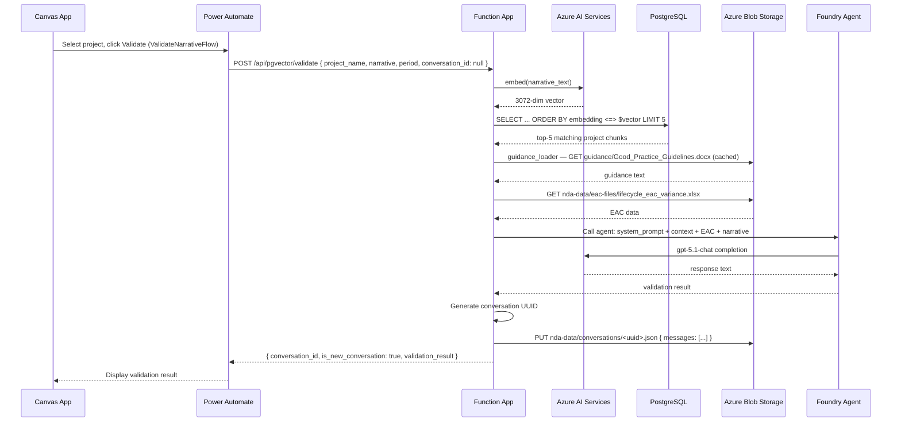
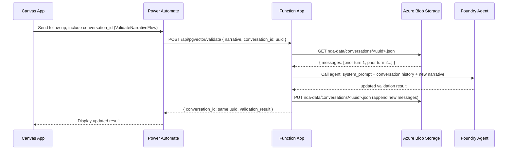
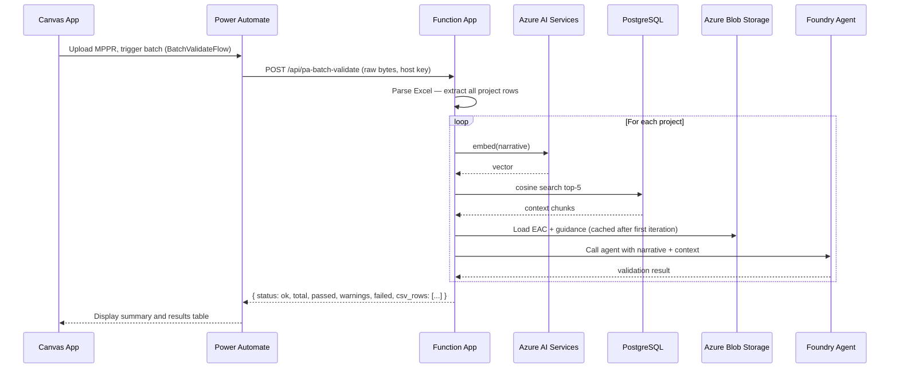
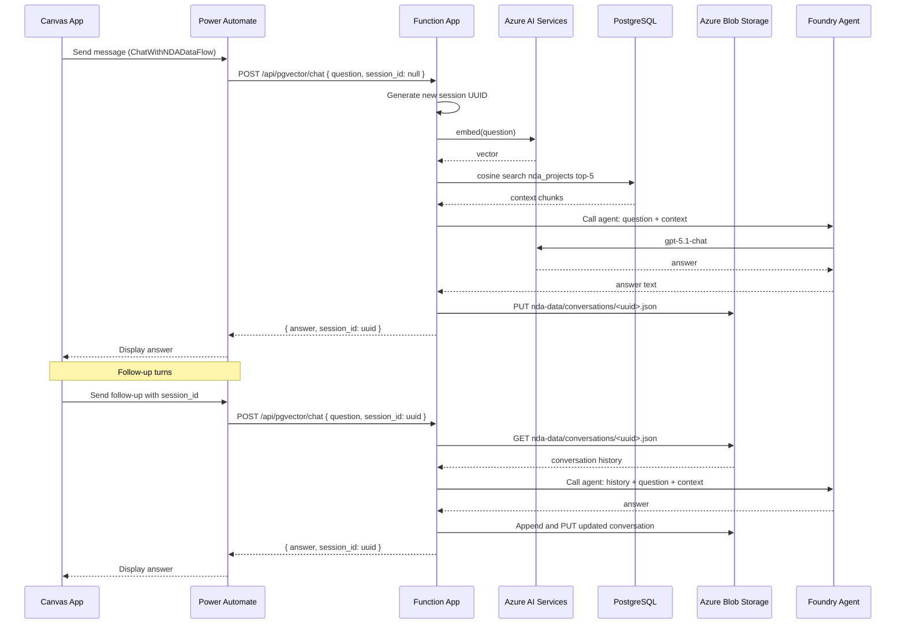
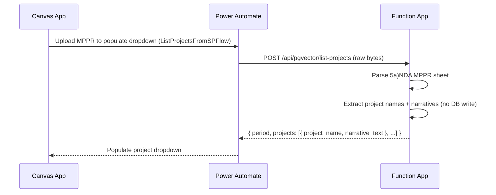
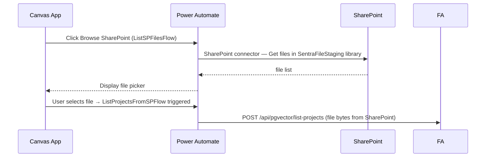

# Design Flows — Foundry Approach

Step-by-step sequence diagrams showing how each request travels from the Canvas App through Power Automate to the Function App and back.

---

## 1. MPPR Ingest

User uploads an Excel file in the Canvas App to populate the project database.

`project_id = "{period}|{project_name}"` — used as the upsert key.

---

## 2. EAC Ingest

User uploads the EAC variance Excel. Stored as a Blob; the agent reads it on each validation call.

---

## 3. Single Narrative Validation

The primary flow — validates one project narrative and returns a structured agent response.

On follow-up calls (e.g. "rewrite just the EAC sentence"), the Canvas App passes back `conversation_id` and the agent picks up the prior context from the Blob.

---

## 4. Follow-up Validation (Conversation Continuity)

---

## 5. Batch Validation (Power Automate)

Validates all narratives in an Excel file in one call. Returns flat CSV rows for easy processing.

---

## 6. Chat

Conversational assistant — multiple turns about the indexed MPPR data.

---

## 7. List Projects (Populate Dropdown)

Before validating, the user uploads an Excel to see available project names without ingesting.

---

## 8. SharePoint File Selection (ListSPFilesFlow)

This flow does **not** call the Function App. It uses Power Platform's native SharePoint connector to list files directly.

