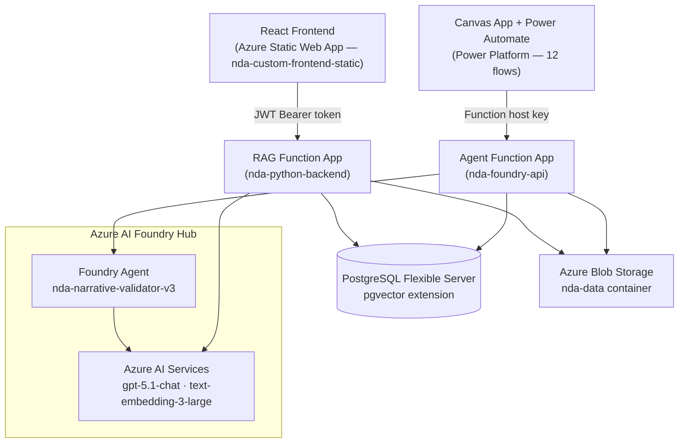
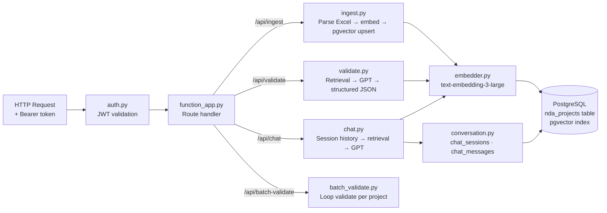
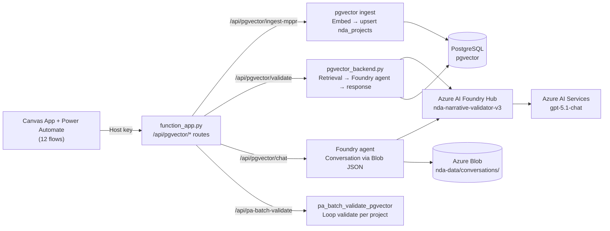

# Architecture

The system provides two independent validation approaches. The Custom approach uses a React frontend talking to the RAG Function App. The Foundry approach uses a Canvas App and Power Automate flows talking to the Agent Function App. Both function apps share the same PostgreSQL database and connect to Azure AI Services which sits inside the Azure AI Foundry Hub.

---

## System Components

---

## Custom Approach — RAG Function App

Handles all user-facing validation for the React frontend. Auth is JWT-based — every request is scoped to the authenticated user.

**Key design points:**
- `ensure_schema()` in `db.py` auto-creates all tables and the pgvector ivfflat index on cold start
- Embeddings are 3072-dim halfvec with cosine similarity (lists=50)
- Chat history: last 20 messages injected per LLM call, full history kept in PostgreSQL for audit
- Data is shared across users — `user_id` is stored as audit metadata only, not used for scoping queries

---

## Foundry Approach — Agent Function App

Used by the Canvas App and Power Automate flows only. No per-user auth — all calls use the Azure Function host key.

**Key design points:**
- `/api/pgvector/*` routes are the active routes — legacy `/api/validate`, `/api/chat` etc. still exist in the code but are AI Search-backed and not used by current flows
- `/api/pa-batch-validate` does not follow the pgvector path convention but internally calls `pa_batch_validate_pgvector()`
- Conversation history is stored as a JSON blob per session UUID — non-fatal if blob write fails

---

## Shared Infrastructure

| Resource | Purpose |
|---|---|
| Azure AI Foundry Hub | Parent resource — hosts the Foundry agent (`nda-narrative-validator-v3`) and Azure AI Services. Both function apps connect to the AI Services endpoint provisioned under this hub. |
| Azure AI Services (under Foundry Hub) | `gpt-5.1-chat` for generation and `text-embedding-3-large` (3072 dims) for embeddings — used by both function apps |
| PostgreSQL Flexible Server | Shared database — pgvector extension, `nda_projects`, `nda_eac_variance`, `chat_sessions`, `chat_messages` tables |
| Azure Blob Storage | `nda-data` container — EAC Excel files, conversation blobs; `guidance` container — Good Practice DOCX |

---

## Authentication Model

| Approach | End user auth | Data scoping |
|---|---|---|
| Custom (RAG) | JWT — PBKDF2-HMAC-SHA256, 8-hour expiry, signed with `JWT_SECRET` | Shared pgvector pool — `user_id` stored for audit only |
| Foundry (Agent) | Azure Function host key embedded in Power Automate flows | No per-user scoping |

First registered user on the Custom app is automatically assigned admin. Admin manages all users from the `/admin` route — no Azure portal access needed for user management.