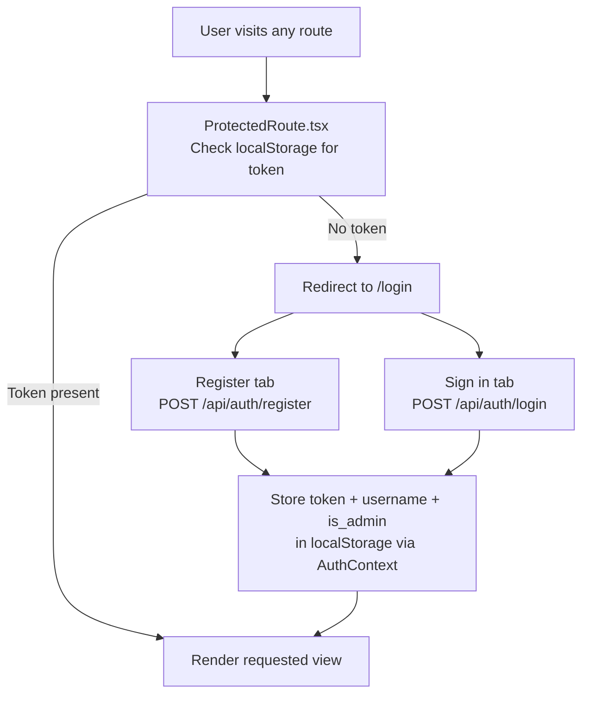
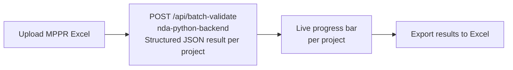

# Frontend

React 19 + TypeScript + Vite. Deployed to Azure Static Web App (`nda-custom-frontend-static`).

URL: `https://lemon-bay-04878fd03.4.azurestaticapps.net`

---

## Auth Flow

- Token survives page refresh — stored in `localStorage`
- Token expiry is 8 hours — expired token returns 401, user is redirected to `/login`
- First registered account is auto-admin — `is_admin` flag comes from the JWT payload

---

## Views

### `/login`
Public — only route accessible without a token.
- Tab switcher between Sign In and Register
- On success: stores token in `AuthContext`, redirects to `/validate`

### `/validate`
Single narrative validation.
- Upload MPPR Excel to populate project dropdown, or type to search projects already indexed in pgvector (wild search via `GET /api/search-projects`)
- Calls `POST /api/validate` on the RAG Function App
- Returns: compliance score, Layer 1 format issues, Layer 2 data issues, AI-rewritten narrative

### `/batch-validate`
Batch validation across all projects in an Excel file. Calls the RAG Function App only — Foundry batch validation is done through the Canvas App and Power Automate flows, not this frontend.

- State is persisted in `ValidationContext` (localStorage) — progress survives page refresh

### `/chat`
Conversational RAG assistant backed by the RAG Function App.
- First message calls `POST /api/chat` — backend creates a session UUID
- Frontend stores `session_id` in state and sends it on every subsequent call
- "New Conversation" clears the session UUID — next message starts a fresh session
- Full history stored in PostgreSQL; last 20 messages injected per LLM call

### `/ingest`
Data upload.
- MPPR Excel → `POST /api/ingest` → embedded and stored in pgvector
- EAC variance Excel → `POST /api/ingest-eac` → stored in `nda_eac_variance`

### `/analytics`
Validation history log — stored in browser `localStorage` via `ValidationContext`.
- Summary cards: Total Scored, Pass, Warnings, Fail, Individual count, Batch count
- Pass rate bar (Pass / Warn / Fail proportions)
- Filterable and sortable scores table with verdict badges and timestamps
- Scoped per browser — does not sync across devices

### `/admin` — admin only
User management.
- Lists all registered users with project and session counts
- Toggle `is_active` and `is_admin` per user
- Delete user and all associated data
- Admin cannot modify or delete their own account

---

## State Management

| Context | Stored in | Contains |
|---|---|---|
| `AuthContext` | `localStorage` | JWT token, username, is_admin flag |
| `ValidationContext` | `localStorage` | Batch/validate progress state, history log |

---

## API Calls

All calls go through `services/api.ts`. Auth routes are public. All other routes attach `Authorization: Bearer <token>` from `AuthContext`.

The base URL (`VITE_API_BASE_URL`) and function key (`VITE_AZURE_FUNCTION_KEY`) are injected at build time from `frontend/.env.production` — they are baked into the bundle and not runtime-configurable.

---

## SPA Routing

`frontend/public/staticwebapp.config.json` configures the Azure Static Web App to fall back to `index.html` for all routes. This allows client-side routing (`/validate`, `/analytics`, etc.) to work when navigated to directly or on page refresh.