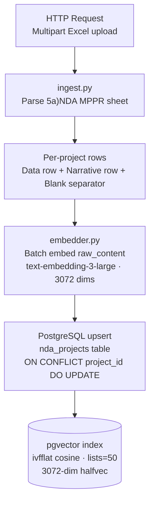
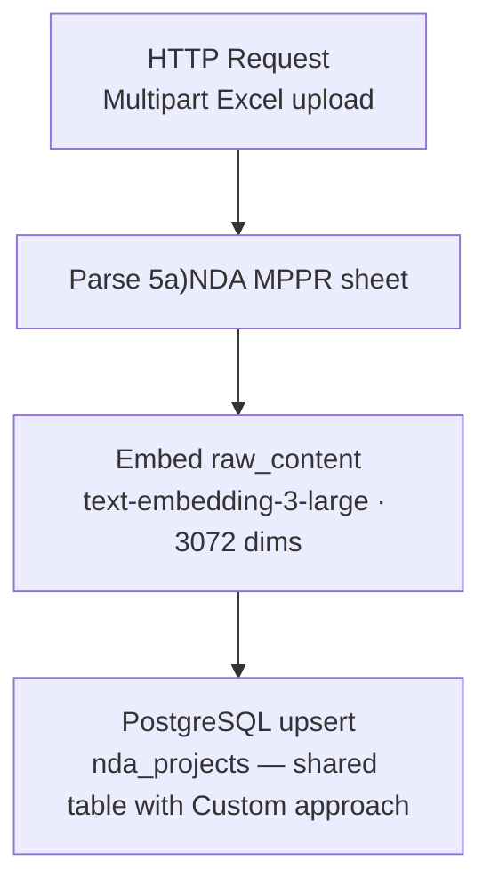
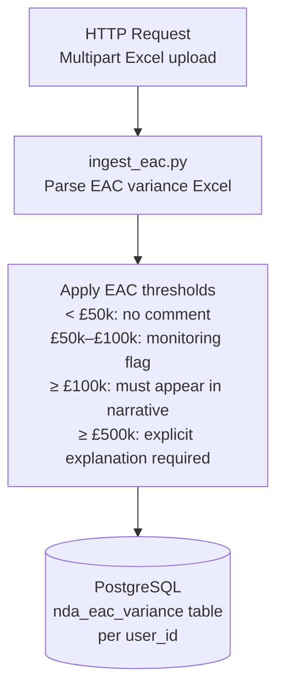
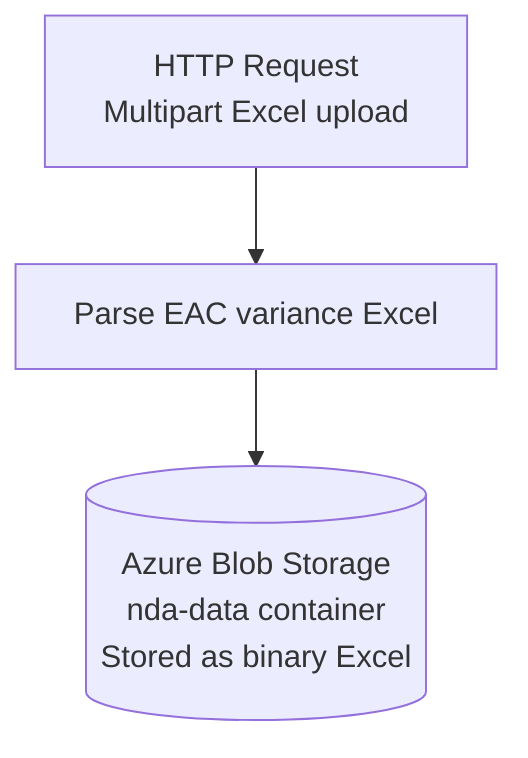

# Ingestion Pipeline

Covers how MPPR and EAC data enters the system for both approaches.

---

## MPPR Ingestion — Custom Approach

Triggered by `POST /api/ingest` on the RAG Function App.

**Excel format expected:**
- Sheet name: `5a)NDA MPPR`
- Each project spans 2–3 rows:
  - Data row: project name (col 1), DCA RAG status (col 3), numeric EAC/schedule data
  - Narrative row: project name (col 0), narrative text (col 1)
  - Blank separator row

**`project_id` key:** `<period_short_name>|<project_name>` — upsert on conflict so re-ingesting the same period overwrites cleanly.

**Data scoping:** `user_id` is stored as audit metadata. All users share the same pgvector pool — ingesting the same project from two accounts overwrites the same row.

---

## MPPR Ingestion — Foundry Approach

Triggered by `POST /api/pgvector/ingest-mppr` on the Agent Function App. Same pipeline as the Custom approach — same Excel format, same pgvector table, same upsert logic.

Both function apps write to the same `nda_projects` table in the same PostgreSQL database.

---

## EAC Ingestion — Custom Approach

Triggered by `POST /api/ingest-eac` on the RAG Function App.

EAC data **is** scoped per user — each user's EAC variance rows are stored with their `user_id` and only used in their own validation runs.

---

## EAC Ingestion — Foundry Approach

Triggered by `POST /api/pgvector/ingest-eac` on the Agent Function App.

EAC data is stored as a raw Excel file in Blob Storage for the Foundry approach. The Foundry agent reads it via a tool call at validation time.

---

## Guidance Document

The Good Practice Guidelines DOCX is stored in the `guidance` Blob container. It is loaded by `guidance_loader.py` in the Agent Function App and injected into the agent's system context at runtime. It is not ingested into pgvector — it is read directly from Blob on each call.

---

## Schema Bootstrap

`db.py` calls `ensure_schema()` on cold start. This creates all required tables and the pgvector index if they do not exist — no manual migration needed during deployment.

For a fresh environment, run `setup_db.py` once first to enable the pgvector extension on the PostgreSQL server before deploying either function app.