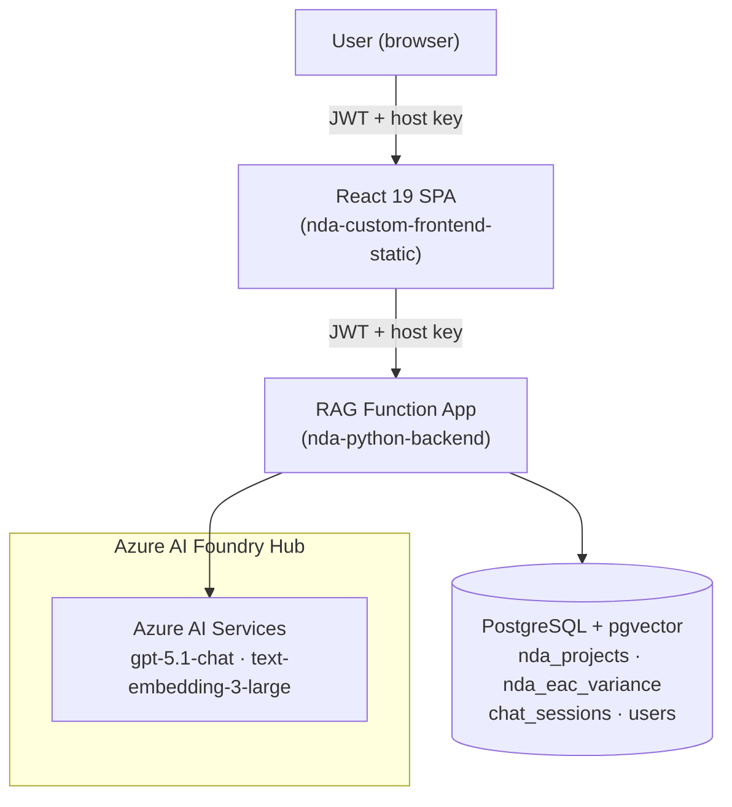

# NDA Narrative Validator — Custom Approach

Azure Functions Python backend + React 19 frontend for validating NDA project narrative reports, backed by PostgreSQL pgvector and Azure OpenAI. JWT-authenticated — users register, log in, and operate within a shared project database.

Validation is structured — the pipeline returns a scored two-layer result (Layer 1 guidance compliance, Layer 2 data-driven checks) with a rewritten narrative.

---

## What this repo contains

| Folder / File | Purpose |
|---|---|
| `rag_function/` | Python Azure Function App — all API routes |
| `frontend/` | React 19 + TypeScript + Vite SPA |
| `setup_db.py` | One-time script to enable pgvector on a new PostgreSQL server |

The React frontend connects only to `nda-python-backend`. There is no connection to the Foundry agent function.

---

## Folder Structure

```
rag_function/
├── function_app.py         Azure Functions v2 entry point — all HTTP route definitions
├── auth.py                 JWT authentication: register, login, token validation
├── db.py                   PostgreSQL connection pool + ensure_schema() on cold start
├── embedder.py             Azure OpenAI embedding wrapper (single + batch)
├── ingest.py               MPPR Excel parser → pgvector upsert (nda_projects)
├── ingest_eac.py           EAC variance Excel parser → upsert (nda_eac_variance)
├── validate.py             Single narrative validation pipeline (Layer 1 + Layer 2)
├── batch_validate.py       Loops validate.py per project row for batch calls
├── chat.py                 Conversational RAG pipeline
├── conversation.py         PostgreSQL-backed chat session and message history
├── guidance_loader.py      Fetches Good Practice Guidelines DOCX from Blob (cached)
├── sharepoint_client.py    SharePoint file listing and download via Graph API
├── requirements.txt        Python dependencies
├── host.json               Azure Functions host configuration
└── local.settings.json     Local env vars — gitignored, never commit

frontend/
├── src/
│   ├── App.tsx             SPA root — React Router route definitions
│   ├── main.tsx            Entry point
│   ├── services/
│   │   └── api.ts          All HTTP calls to the Function App — single source of truth
│   ├── context/
│   │   ├── AuthContext.tsx       JWT token + user state (persisted in localStorage)
│   │   └── ValidationContext.tsx Batch validation state (persisted in localStorage)
│   ├── components/
│   │   ├── ProtectedRoute.tsx    Redirects unauthenticated users to /login
│   │   └── Sidebar.tsx           Navigation — hides /admin if not admin
│   └── views/
│       ├── LoginView.tsx         Register + sign-in tabs
│       ├── ValidateView.tsx      Single narrative validation
│       ├── BatchValidateView.tsx Upload MPPR → validate all projects
│       ├── ChatView.tsx          Conversational RAG assistant
│       ├── IngestView.tsx        MPPR + EAC upload, SharePoint browser
│       ├── AnalyticsView.tsx     Validation history (reads from localStorage)
│       └── AdminView.tsx         User management — admin only
└── public/
    └── staticwebapp.config.json  Azure Static Web App routing (serves index.html for all routes)
```

---

## How it works



1. The user registers or logs in through the React frontend. A JWT token is issued on success.
2. The frontend includes the JWT on every API call to the Function App.
3. For validation, the Function App embeds the narrative using `text-embedding-3-large`, searches `nda_projects` with cosine similarity, retrieves EAC data, then calls `gpt-5.1-chat` to produce a two-layer validation result.
4. Conversation history for the chat view is stored per-user in PostgreSQL.

---

## Deployment

```bash
# Backend
cd rag_function
func azure functionapp publish nda-python-backend --python

# Frontend
cd frontend
npm run build
# Deploy dist/ to Azure Static Web App: nda-custom-frontend-static
```

Run `python setup_db.py` once on any new PostgreSQL server before deploying.

---

## Documentation

| Doc | Contents |
|---|---|
| [Architecture](docs/architecture.md) | System components, sequence diagrams, ER diagram |
| [API Endpoints](docs/api-endpoints.md) | All routes with request/response examples |
| [Code Structure](docs/code-structure.md) | What each file does and why |
| [Design Flows](docs/design-flows.md) | Step-by-step request flows from browser to response |
| [Frontend](docs/frontend.md) | React views, endpoint connections, state management, auth flow |

---

## Key environment variables

Set in **Azure Function App → Settings → Environment variables** in production. Locally, add to `rag_function/local.settings.json`.

| Variable | Purpose |
|---|---|
| `JWT_SECRET` | Signs all JWT tokens — must be set before first use |
| `POSTGRES_HOST` | PostgreSQL server hostname |
| `POSTGRES_DB` | Database name |
| `POSTGRES_USER` | DB user |
| `POSTGRES_PASSWORD` | DB password (leave empty for Managed Identity) |
| `AZURE_OPENAI_ENDPOINT` | Azure AI Services endpoint URL |
| `AZURE_OPENAI_API_KEY` | Azure AI Services API key |
| `AZURE_OPENAI_EMBEDDING_DEPLOYMENT` | Embedding model (text-embedding-3-large) |
| `AZURE_OPENAI_EMBEDDING_DIMS` | Embedding dimensions (3072) |
| `AZURE_OPENAI_CHAT_DEPLOYMENT` | Chat model deployment name (gpt-5.1-chat) |