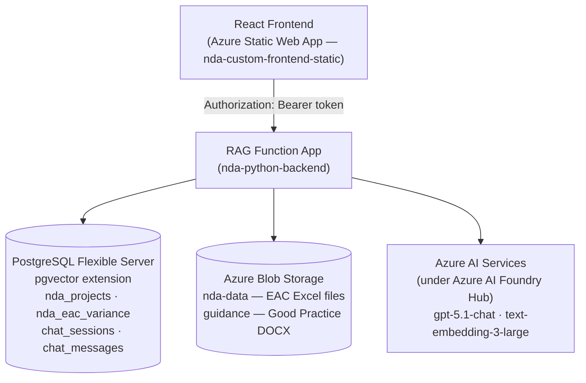
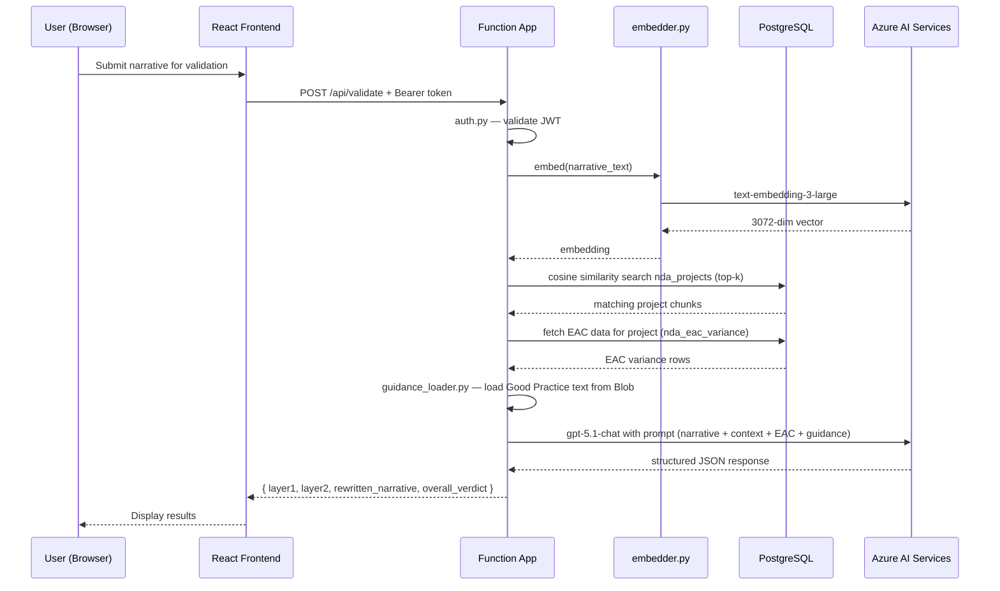
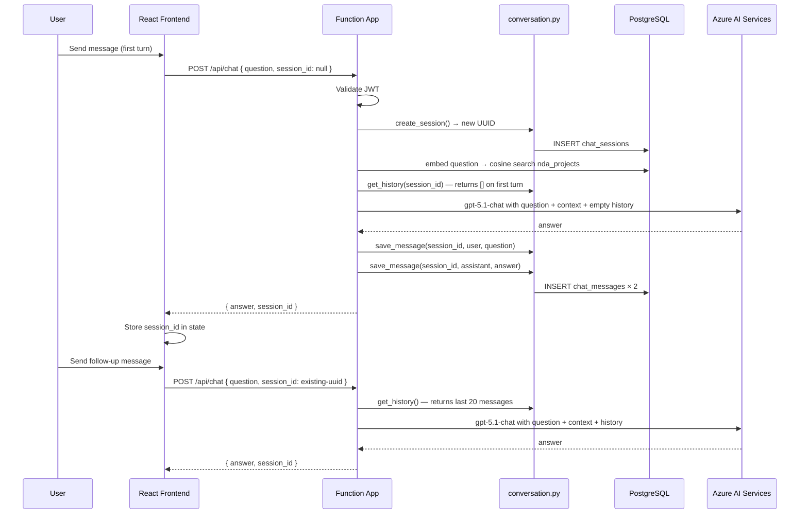
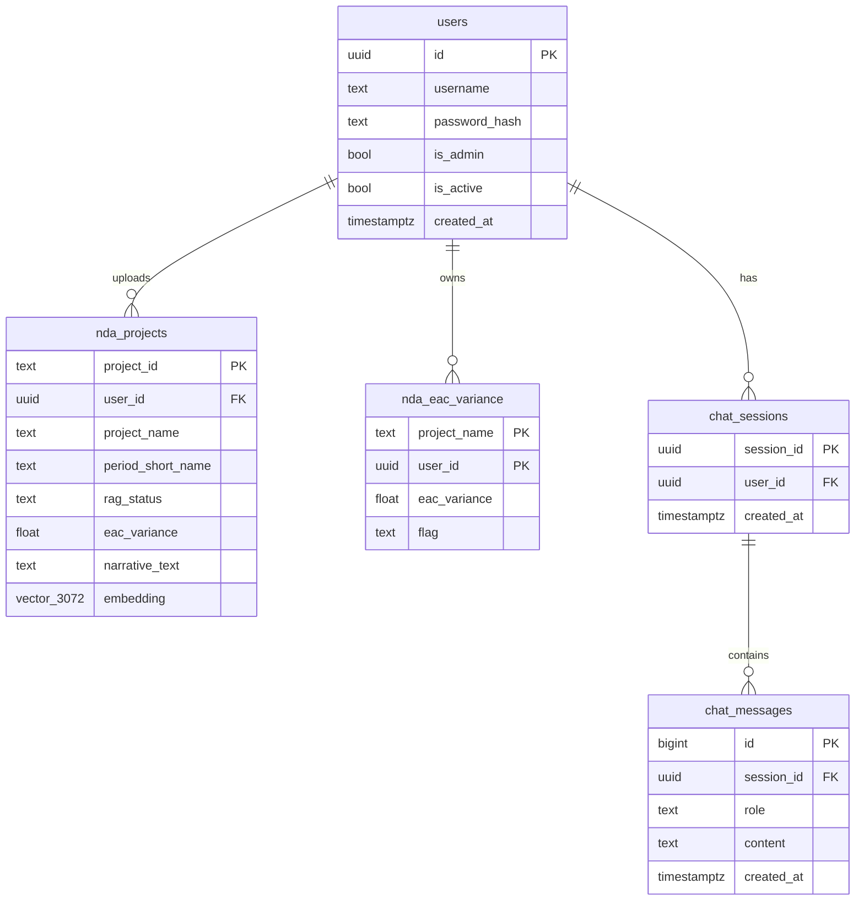

# Architecture — Custom Approach

---

## System Overview

---

## Request Flow — Validation

---

## Request Flow — Chat

---

## Database Schema

**Note:** `nda_projects.project_id` = `"{period}|{project_name}"` — this is a shared table. All users read from the same pool. `user_id` is audit metadata only. `nda_eac_variance` is the only table with true per-user isolation.

---

## Component Responsibilities

| Component | Responsibility |
|---|---|
| `function_app.py` | Route definitions, request parsing, error handling |
| `auth.py` | JWT sign/verify, user registration/login, admin operations |
| `db.py` | Connection pool, schema bootstrap, pgvector search |
| `embedder.py` | Single and batch embedding via Azure OpenAI |
| `ingest.py` | MPPR Excel parsing, project extraction, pgvector upsert |
| `ingest_eac.py` | EAC Excel parsing, threshold calculation, PostgreSQL upsert |
| `validate.py` | Full validation pipeline: embed → retrieve → EAC check → GPT |
| `batch_validate.py` | Loops `validate.py` for every project in an Excel |
| `chat.py` | Conversational RAG: history + retrieval + GPT |
| `conversation.py` | chat_sessions/chat_messages CRUD |
| `sharepoint_client.py` | Lists and downloads files from SharePoint |
| `guidance_loader.py` | Fetches Good Practice DOCX from Azure Blob |