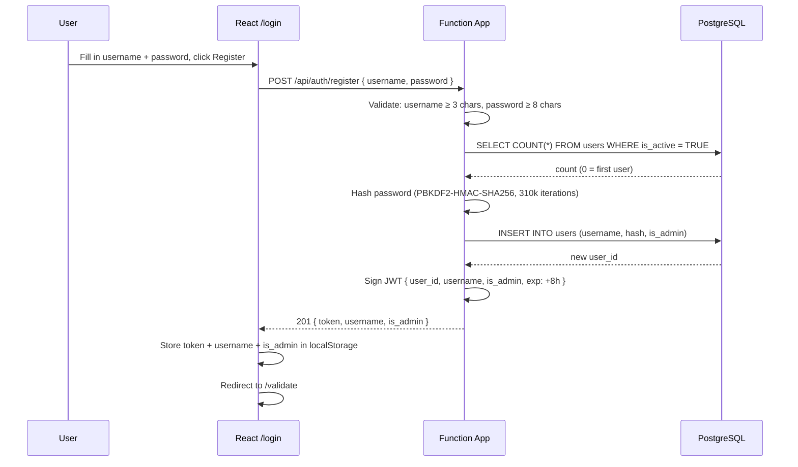
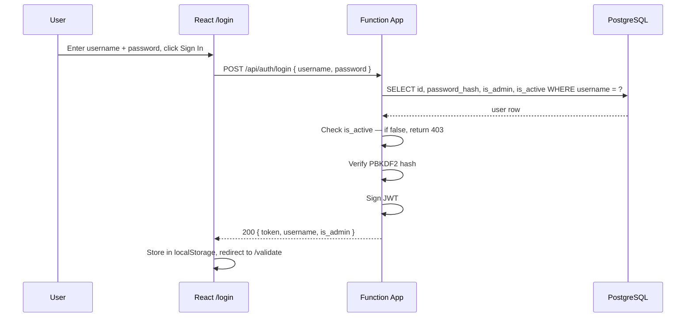
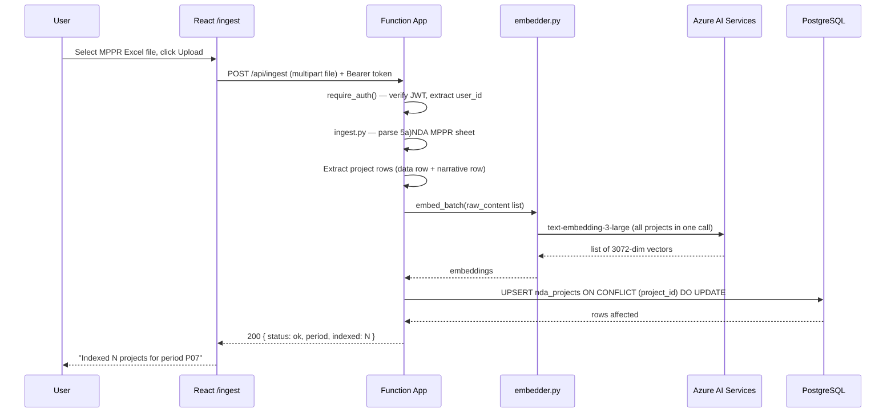
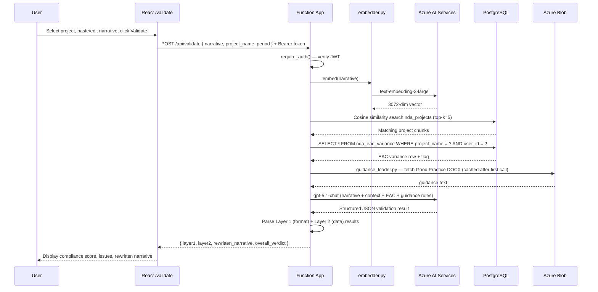
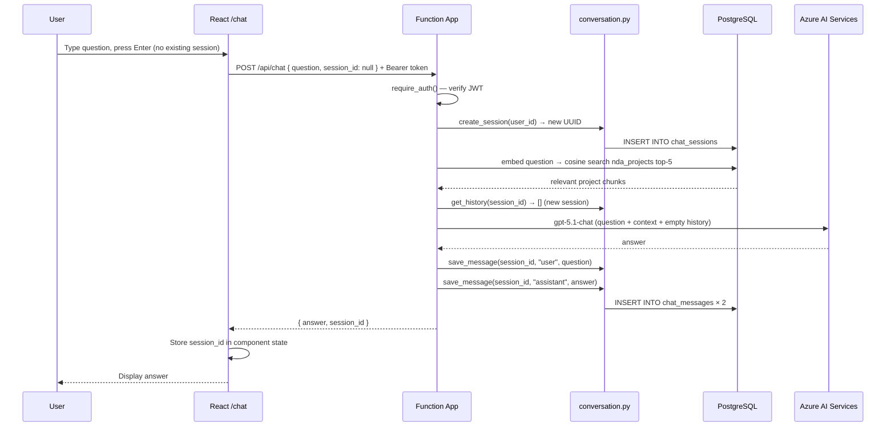
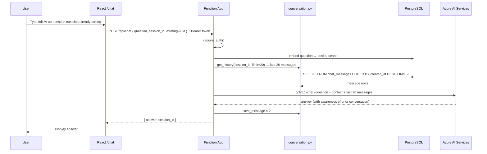
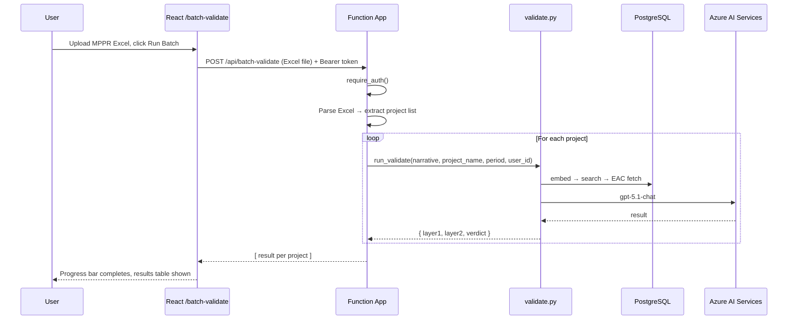
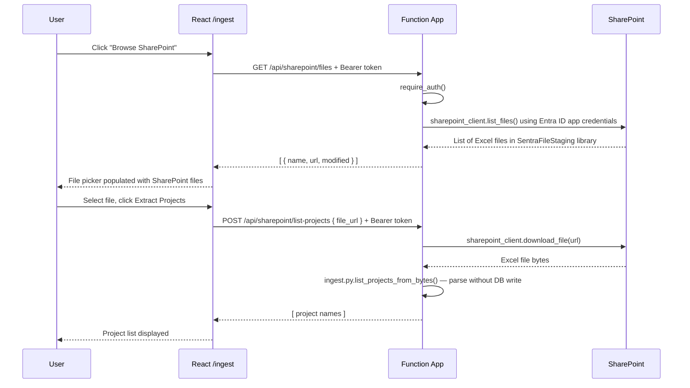

# Design Flows — Custom Approach

Step-by-step flows from user action to response for every key operation.

---

## 1. User Registration

---

## 2. User Login

---

## 3. MPPR Data Ingest

---

## 4. Single Narrative Validation

---

## 5. Conversational Chat — First Message

---

## 6. Conversational Chat — Follow-up Message

---

## 7. Batch Validation

---

## 8. SharePoint File Browse

