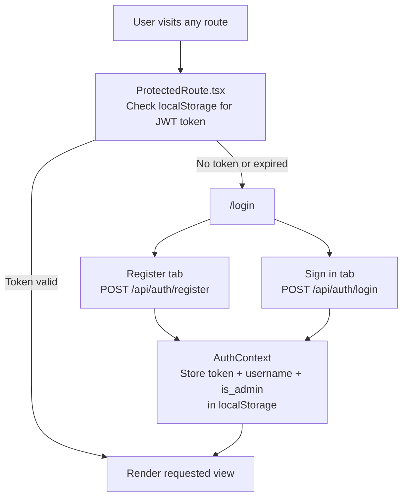

# Frontend — Custom Approach

React 19 + TypeScript + Vite. Deployed to Azure Static Web App (`nda-custom-frontend-static`).

URL: `https://lemon-bay-04878fd03.4.azurestaticapps.net`

This frontend is for the Custom approach only. The Foundry approach is accessed through the Canvas App in Power Platform.

---

## Auth Flow

Token is stored in `localStorage` and survives page refresh. On a 401 response from any route, the frontend clears the token and redirects to `/login`. Token expires after 8 hours.

---

## Views and Endpoint Connections

### `/login` — public

No token required. Only route accessible without authentication.

| Action | Endpoint called | When |
|---|---|---|
| Click Register | `POST /api/auth/register` | On form submit |
| Click Sign In | `POST /api/auth/login` | On form submit |

On success: token stored in `AuthContext`, redirected to `/validate`.

---

### `/validate` — auth required

Single narrative validation.

| Action | Endpoint called | When |
|---|---|---|
| Type in project search box | `GET /api/search-projects?q=<term>` | On input change (debounced) |
| Upload MPPR Excel to populate list | `POST /api/list-projects` | On file select |
| Click Validate | `POST /api/validate` | On button click |

**Flow:**
1. User either uploads an Excel (calls `list-projects` to get project names) or types to search already-indexed projects (`search-projects`).
2. Selects a project and pastes/edits the narrative.
3. Clicks Validate → calls `POST /api/validate`.
4. Response is displayed: compliance score, Layer 1 issues, Layer 2 issues, rewritten narrative.

---

### `/batch-validate` — auth required

Batch validation across all projects in an Excel file. Calls the RAG Function App only.

| Action | Endpoint called | When |
|---|---|---|
| Upload MPPR Excel | `POST /api/batch-validate` | On file upload + click Run |

**Flow:**
1. User uploads MPPR Excel.
2. Frontend calls `POST /api/batch-validate` with the file.
3. Progress bar shows per-project progress.
4. Results table populates as results arrive.
5. Export to Excel button available on completion.

State is persisted in `ValidationContext` (localStorage) — progress survives page refresh.

---

### `/chat` — auth required

Conversational RAG assistant.

| Action | Endpoint called | When |
|---|---|---|
| Send first message | `POST /api/chat { question, session_id: null }` | On send |
| Send follow-up | `POST /api/chat { question, session_id: uuid }` | On send |
| Click New Conversation | (clears session_id from state) | On button click |

**Flow:**
1. First message: no `session_id` sent → server creates a new session, returns UUID.
2. Frontend stores `session_id` in component state.
3. Every subsequent message includes the `session_id` → server loads last 20 messages of history.
4. "New Conversation" clears the `session_id` — next message starts fresh.

Chat history is stored in PostgreSQL. It is not stored in `localStorage` — clearing browser storage does not lose history if you log in again with the same account.

---

### `/ingest` — auth required

Data upload.

| Action | Endpoint called | When |
|---|---|---|
| Upload MPPR Excel | `POST /api/ingest` | On file select + upload |
| Upload EAC Excel | `POST /api/ingest-eac` | On file select + upload |
| Browse SharePoint | `GET /api/sharepoint/files` | On button click |
| Select SharePoint file → Extract | `POST /api/sharepoint/list-projects` | On file select |

---

### `/analytics` — auth required

Validation history log. No API calls — reads entirely from `localStorage` via `ValidationContext`.

- Shows every validation run (individual and batch) since last browser clear.
- Summary cards: Total Scored, Pass, Warnings, Fail.
- Pass rate bar.
- Filterable and sortable results table.

---

### `/admin` — admin JWT required

User management. Only visible in the sidebar if `is_admin = true` in the JWT.

| Action | Endpoint called | When |
|---|---|---|
| Page load | `GET /api/mgmt/users` | On mount |
| Toggle active/inactive | `POST /api/mgmt/users/update` | On toggle |
| Toggle admin rights | `POST /api/mgmt/users/update` | On toggle |
| Delete user | `POST /api/mgmt/users/delete` | On confirm |

---

## State Management

| Context | Storage | Contains |
|---|---|---|
| `AuthContext` | `localStorage` | JWT token, username, is_admin flag |
| `ValidationContext` | `localStorage` | Batch/validate history log, in-progress batch state |

Both contexts are initialised from `localStorage` on page load, so state survives refresh.

---

## Environment Variables (baked in at build time)

Set in `frontend/.env.production`. Vite embeds these into the compiled bundle — they are not runtime-configurable.

| Variable | Purpose |
|---|---|
| `VITE_API_BASE_URL` | RAG Function App base URL — `https://nda-python-backend.azurewebsites.net/api` |
| `VITE_AZURE_FUNCTION_KEY` | Function App host key — appended to every request as `?code=<key>` |

---

## SPA Routing

`frontend/public/staticwebapp.config.json` tells Azure Static Web Apps to serve `index.html` for all routes. This means `/validate`, `/analytics`, etc. work when accessed directly or on page refresh.